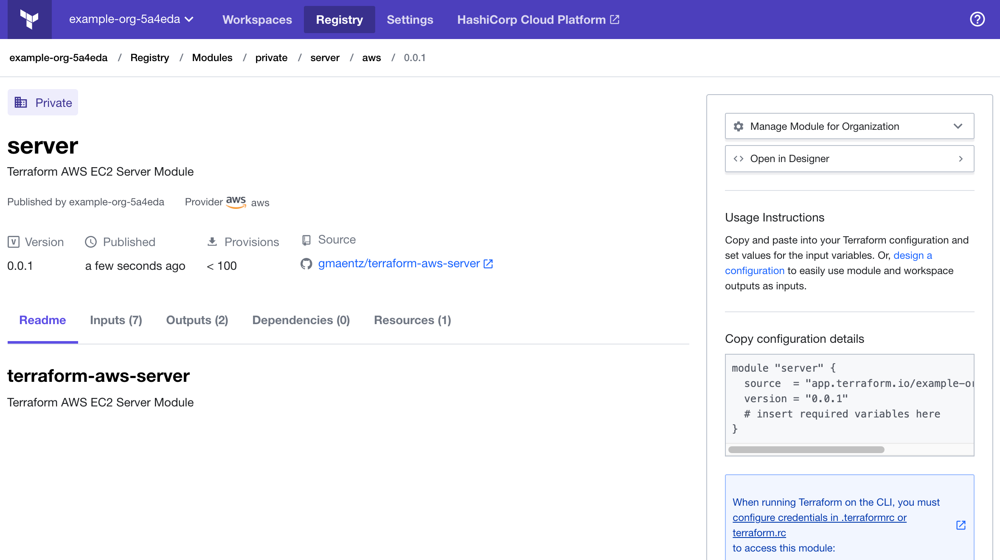

# Lab: Publish Module to Registry

In this challenge you will register a module with your Private Module Registry then reference it in a workspace.

Duration: 20 minutes

- Task 1: Create a Module Repository in GitHub
- Task 2: Update Module Code to GitHub
- Task 3: Publish Module
- Task 4: Update Terraform Configuration to use Private Module source

## Task 1: Create a Module Repository in GitHub

Login to github and create a new repository by navigating to <https://github.com/new>.  Create a new GitHub repository with the name `terraform-aws-server`

Use the following settings:

- Name: `terraform-aws-server`
- Description: `Terraform AWS EC2 Server Module`
- Private repo
- Check "Initialize this repository with a README"
- Add `.gitignore` of type "Terraform"

Once created, clone the repository to your local machine.

```
cd /workstation/terraform
sudo git clone https://github.com/<YOUR_GIT_HUB_ACCOUNT>/terraform-aws-server.git
cd terraform-aws-server
```

Create a GitHub Personal Access Token

https://docs.github.com/en/authentication/keeping-your-account-and-data-secure/creating-a-personal-access-token

## Task 2: Update Module Code to GitHub
In your local repository copy the contents of the `server` folder to the `terraform-aws-server` folder.

```
cd /workstation/terraform
cp -r ./server/* ./terraform-aws-server
```

Commit the changes in GitHub.

```
cd /workstation/terraform/terraform-aws-server
sudo git add .
sudo git commit -m "update with terraform code"
sudo git push
```

## Task 3: Publish Modules

Before we can use our new module, we need to add it to the Private Module Registry.

Navigate back to Terraform Cloud and click the "Registry" menu at the top of the page. From there click the "Publish A Module" button.


Select the repository you created above ("terraform-aws-server").


> Note: You will see your github user name since the repo is in your github account.

Click "Publish Module".

This will query the repository for necessary files and tags used for versioning.

> Note: this could take a few minutes to complete.

Congrats, you are done!

Ok, not really...

We need to tag the repository to be able to publish a version.

```sh
git tag v0.0.1 main
git push origin v0.0.1
```



## Task 4: Update Terraform Configuration to use Private Module source

Update the `source` and `version` arguments on the module declaration in your `main.tf`

```hcl
module "server" {
  source                 = "app.terraform.io/example-org-5a4eda/server/aws"
  version                = "0.0.1"
  for_each               = local.servers
  server_os              = each.value.server_os
  identity               = each.value.identity
  subnet_id              = each.value.subnet_id
  vpc_security_group_ids = each.value.vpc_security_group_ids
}
```

Reinitialize your your terraform configuration to use the new module sourced from the private module registry.

```bash
cd /workstation/terraform
terraform init
terraform plan
```

```bash
Initializing modules...
Downloading app.terraform.io/example-org-5a4eda/server/aws 0.0.1 for server...
- server in .terraform/modules/server
```

This should result in a zero change plan, despite the module source update.

```bash
─────────────────────────────────────────────────────────────────────────────

No changes. Your infrastructure matches the configuration.

Your configuration already matches the changes detected above. If you'd like
to update the Terraform state to match, create and apply a refresh-only plan.
```