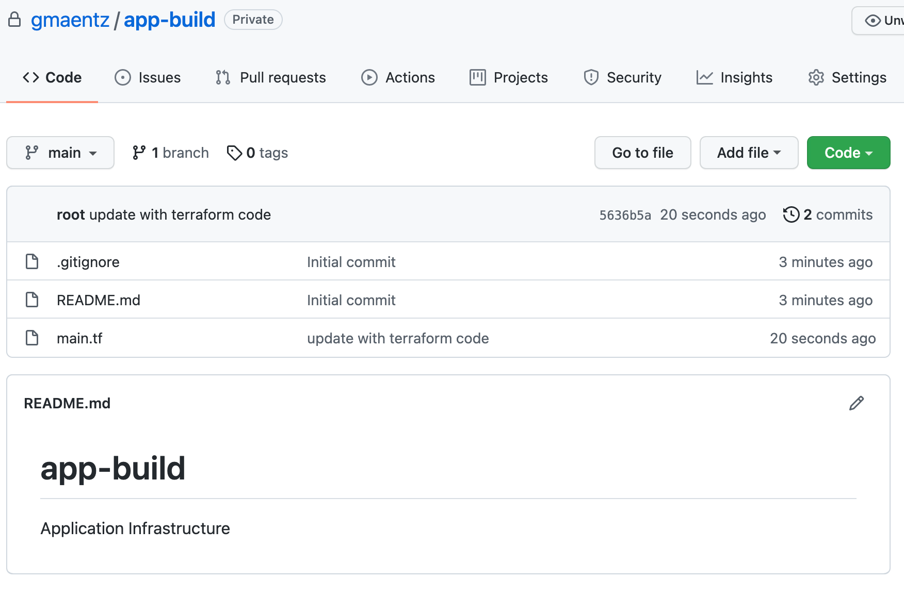
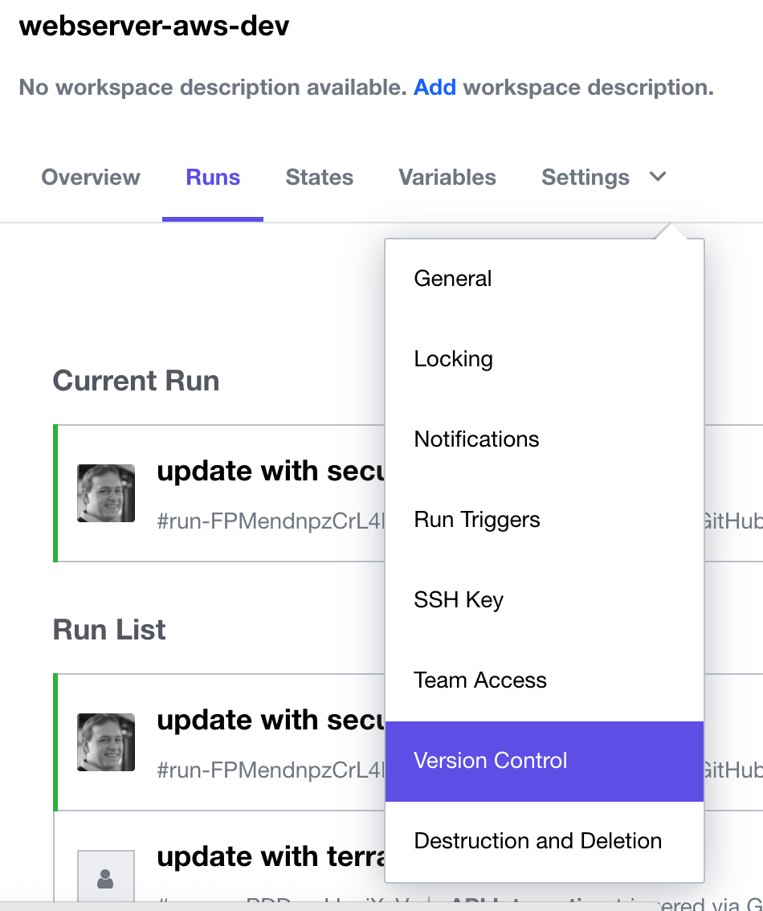
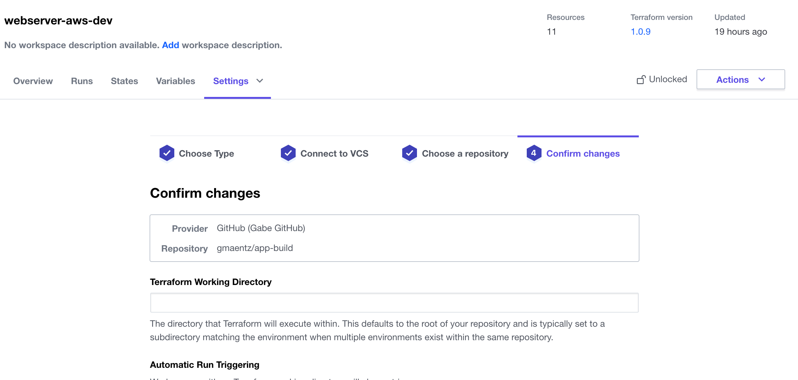
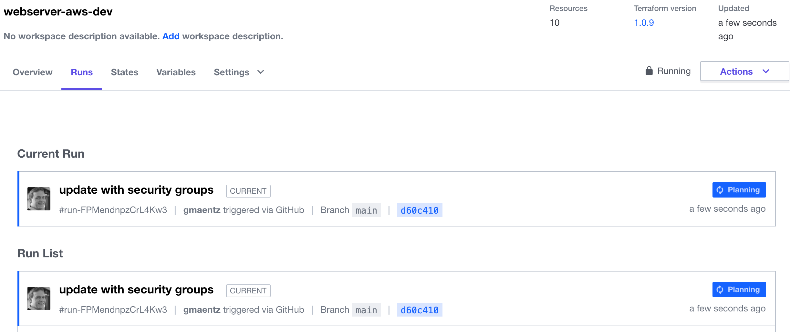
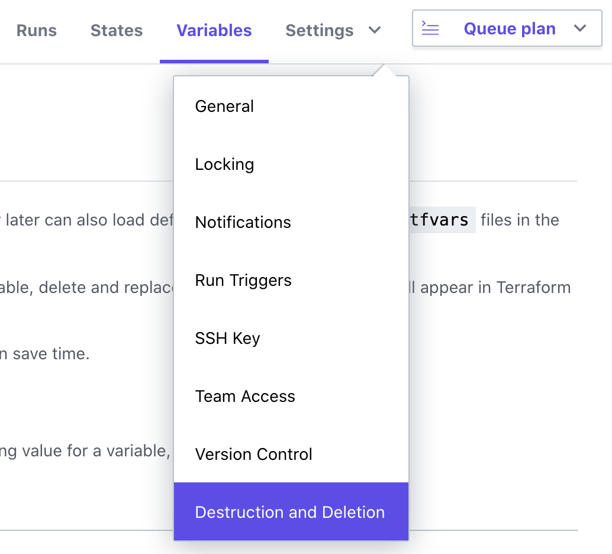

# Lab: Terraform Enterprise - Workspaces

## Expected Outcome

In this challenge, you will create a repository, and link it to a TFC workspace via a VCS connection.

Duration: 20 minutes

- Task 1: Create an code repository in GitHub
- Task 2: Update App Code to GitHub
- Task 3: Update Terraform Workspace to VCS Workflow
- Task 4: CLI Behavior for VCS Connected Workspaces
- Task 5: Destroy Infrastructure (Optional)

## Task 1: [GitHub] Create a new github repository

Login to github and create a new repository by navigating to <https://github.com/new>.

Use the following settings:

- Name: `app-build`
- Description: `Application Infrastructure`
- Private repo
- Check "Initialize this repository with a README"
- Add `.gitignore` of type "Terraform"

Once created, clone the repository to your local machine.

```
cd /workstation/terraform
sudo git clone https://github.com/<YOUR_GIT_HUB_ACCOUNT>/app-build.git
cd app-build
```

## Task 2: Update App Code to GitHub

In your repository copy the `main.tf` file from your default module

Commit the changes in GitHub.

```
cd /workstation/terraform/app-build
cp ../main.tf .
sudo git add .
sudo git commit -m "update with terraform code"
sudo git push
```

> **WARNING** :
> Do not upload your `terraform.tfvars` into a public GitHub repository because this file does contain sensitive information about the AWS account.



## Task 3: Connect VCS to Workspace

Connect your Workspace to the GitHub `app-build` repository by going to the Settings of your workspace and selecting `Version Control`. Select your GitHub VCS connection and then point it to the `app-build` repository.





### [TFC] Plan and Apply

Notice that a run will automatically get triggered once connected to the GitHub repository.


The security groups are marked for deletion because we did not copy over the `securitygroups.tf` file into our repository so we have confirmed that this workspace is now tied to the `main` branch of our GitHub `app-build` repository.

This is fine for now so `Confirm and Apply` the run.

### Add Security Groups Back

Let's make an update to our code repo by copying over the `securitygroups.tf` file into our repository.

```bash
cd /workstation/terraform/app-build
cp ../securitygroups.tf .
sudo git add .
sudo git commit -m "update with security groups"
sudo git push
```

Notice that a Terraform run is automatically triggered when code is pushed to the GitHub repository, along with the commit message. You now can manage your infrastructure by performing code updates GitHub.



Confirm and Apply the run if it looks good.

## Task 4: CLI Behavior for VCS Connected Workspaces

When we moved from a CLI to VCS driven workflow we told Terraform that all changes should now be driven by code commits.  We can validate this by attempting to run an apply from the root module in which we were previously executing CLI commands.

```bash
cd /workstation/terraform
terraform apply
```

```bash
│ Error: Apply not allowed for workspaces with a VCS connection
│
│ A workspace that is connected to a VCS requires the VCS-driven workflow to ensure that the VCS remains the single source of
│ truth.
```

We can however still run a `terraform plan` on a VCS connected workspace in the event we need to develop locally and perform a planning operation before pushing our code for an apply.

```bash
cd /workstation/terraform
terraform plan
```

```bash
Running plan in the remote backend. Output will stream here. Pressing Ctrl-C
will stop streaming the logs, but will not stop the plan running remotely.

Preparing the remote plan...

To view this run in a browser, visit:
https://app.terraform.io/app/example-org-5a4eda/webserver-aws-dev/runs/run-g6AKJHDctbvqFCyX

Waiting for the plan to start...

Terraform v1.0.9
on linux_amd64
Configuring remote state backend...
Initializing Terraform configuration...
aws_security_group.main: Refreshing state... [id=sg-0d310c0f062f47649]
module.s3-bucket.aws_s3_bucket.this[0]: Refreshing state... [id=rpt-tf201-training-bucket]
module.server["server-apache"].aws_instance.web: Refreshing state... [id=i-09deda8e9741ed75a]
module.server["server-iis"].aws_instance.web: Refreshing state... [id=i-0bfcee5c257b1fc62]
module.s3-bucket.aws_s3_bucket_public_access_block.this[0]: Refreshing state... [id=rpt-tf201-training-bucket]

Terraform detected the following changes made outside of Terraform since the
last "terraform apply":

  # aws_security_group.main has been changed
  ~ resource "aws_security_group" "main" {
        id                     = "sg-0d310c0f062f47649"
        name                   = "core-sg"
      + tags                   = {}
        # (8 unchanged attributes hidden)
    }

Unless you have made equivalent changes to your configuration, or ignored the
relevant attributes using ignore_changes, the following plan may include
actions to undo or respond to these changes.

─────────────────────────────────────────────────────────────────────────────

Changes to Outputs:
  + cost_code    = "10-23"
  + department   = "ABC"
  + my_number    = "867-5309"
  + phone_number = (sensitive value)

You can apply this plan to save these new output values to the Terraform
state, without changing any real infrastructure.

------------------------------------------------------------------------

Cost estimation:

Resources: 2 of 2 estimated
           $21.06079999999999992/mo +$0.0
```

## Task 5: Destroy Infrastructure (Optional)

We can also easily clean up the infrastructure by performing a destroy. Click the Workspace "Setting" menu -> "Destruction and Deletion"



Click the "Queue destroy plan" to queue a destructive plan.


If the destroy plan looks good, apply it.
