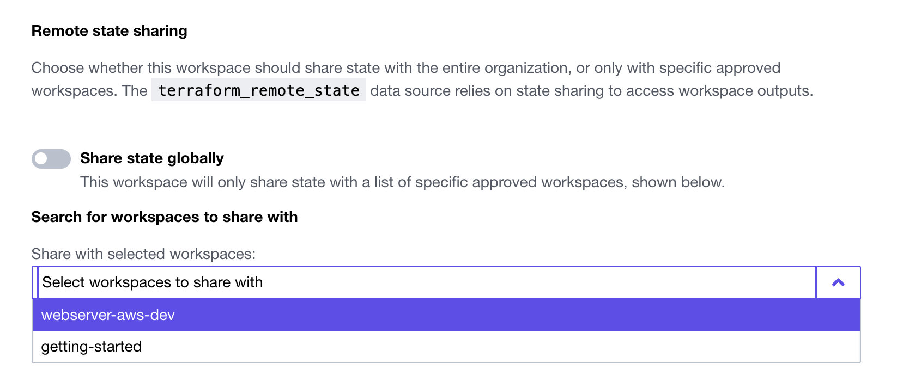

# Lab : Null Resources

Duration: 20 minutes

This lab demonstrates the use of the `null_resource`. Instances of `null_resource` are treated like normal resources, but they don't do anything. Like with any other resource, you can configure provisioners and connection details on a null_resource. You can also use its triggers argument and any meta-arguments to control exactly where in the dependency graph its provisioners will run.

- Task 1: Create a AWS Instance using Terraform
- Task 2: Create SSH Key Pair for AWS
- Task 3: Deploy Web application using `null_resource` with a VM to take action with `triggers`

We'll demonstrate how `null_resource` can be used to take action on a set of existing resources that are specified within the `triggers` argument

## Task 1: Create Server Instances using Terraform

Build the web servers using the AWS Server Modules (previous labs)

You can see this now if you run `terraform apply`:

```text
...

Apply complete! Resources: 0 added, 0 changed, 0 destroyed.

...
```

## Task 2: Create SSH Key Pair for AWS

Let's create a seperate workspace within TFC for shared infrastructure, including our SSH Keys.

```shell
mkdir -p /workstation/terraform/sshkeys && cd $_
touch terraform.tf
touch sshkey.tf
```

`terraform.tf`

```hcl
terraform {
  backend "remote" {
    organization = "example-org-5a4eda"

    workspaces {
      name = "ssh-keys"
    }
  }
}
```

> Note: Replace with your TFC Organization above and your intials in the `name` argument below

`sshkey.tf`

```hcl
variable "access_key" {
  description = "AWS Access Key"
}

variable "secret_key" {
  description = "AWS Secret Key"
}

variable "region" {
  description = "AWS Region"
  default     = "us-east-1"
}

provider "aws" {
  access_key = var.access_key
  secret_key = var.secret_key
  region     = var.region
}

module "keypair" {
  source  = "mitchellh/dynamic-keys/aws"
  version = "2.0.0"
  path    = "${path.root}/keys"
  name    = "appkey-ghm"
}

output "key_name" {
  value = module.keypair.key_name
}

output "private_key" {
  value = module.keypair.private_key_pem
  sensitive = true
}
```

```shell
terraform init
terraform apply
```

> Note: This may error on not finding AWS credentials which you will have to set in the `ssh-keys` workspace variables.

## Task 2: Update our Module to use our shared infrastructure key from the `ssh-keys` workspace

Update the `main.tf` within the `app-build` directory to use our shared infrastructure key from the `ssh-keys` workspace

`main.tf`

```hcl
data "terraform_remote_state" "ssh-keys" {
  backend = "remote"

  config = {
    hostname = "app.terraform.io"
    organization = "example-org-5a4eda"

    workspaces = {
      name = "ssh-keys"
    }
  }
}

module "server" {
  source                 = "app.terraform.io/example-org-5a4eda/server/aws"
  version                = "0.0.1"
  for_each               = local.servers
  server_os              = each.value.server_os
  identity               = each.value.identity
  subnet_id              = each.value.subnet_id
  vpc_security_group_ids = each.value.vpc_security_group_ids
  key_name               = data.terraform_remote_state.ssh-keys.outputs.key_name
}
```

## Task 3: Use `null_resource` with an EC2 instance to take action with `triggers`

Create an application terraform configuration in `app.tf` within the `app-build` directory that utilizes `null_resource` stanza to deploy our web application. Notice that the trigger for this resource is set to fire on.

`app.tf`

```hcl
resource "null_resource" "web_app" {
  # Changes to any number of app servers requires re-provisioning
  triggers = {
    web_app_instances = "${join(",", module.server["server-apache"].public_dns)}"
  }

  # Bootstrap script can run on any instance of the cluster
  # So we just choose the first in this case
  connection {
    host = element(module.server["server-apache"].public_ip, 0)
    user = "ubuntu"
    private_key = data.terraform_remote_state.ssh-keys.outputs.private_key
  }

  provisioner "file" {
    source      = "assets"
    destination = "/tmp/"
  }

  provisioner "remote-exec" {
    inline = [
      "sudo sh /tmp/assets/setup-web.sh",
    ]
  }
}
```

Copy the web app to the within the `app-build` directory.

```bash
cd /workstation/terraform/app-build
cp -r ../assets .
sudo git add .
sudo git commit -m "update with application deployment"
sudo git push
```

## Allow Remote Shared State

We are leveraging a technique to query shared remote state from another workspace - namely the shared SSH Keys.  This is a powerful technique for organizing our infrastructure and limiting the risk of a single change.  In order to have one workspace read the data of another workspace it must be explicitly allowed.


Go to the `shared-keys` workspace under the `Settings` > `General` and enable our `webserver-aws-dev` workspace to read our ssh keys output.

