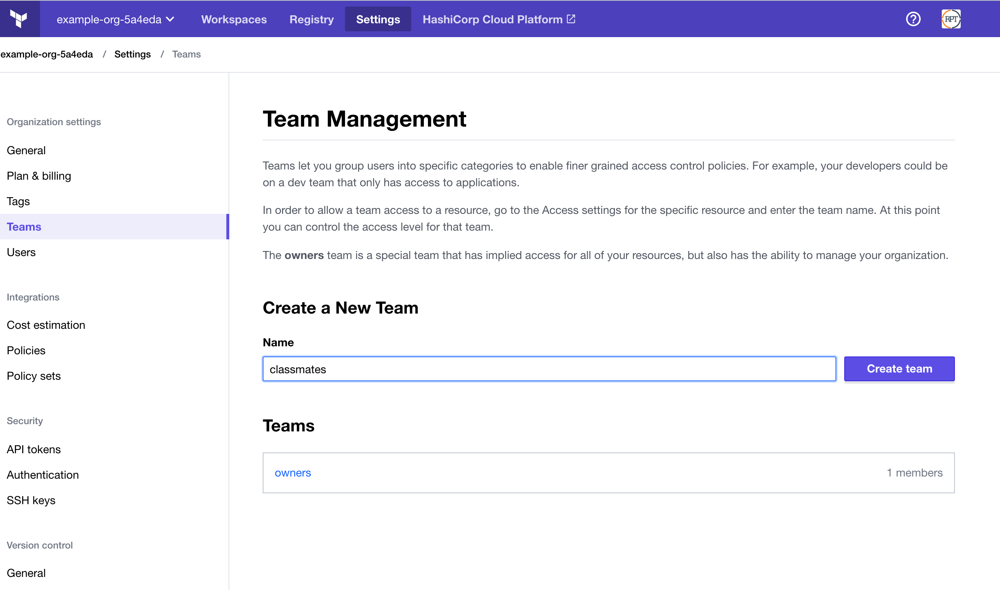
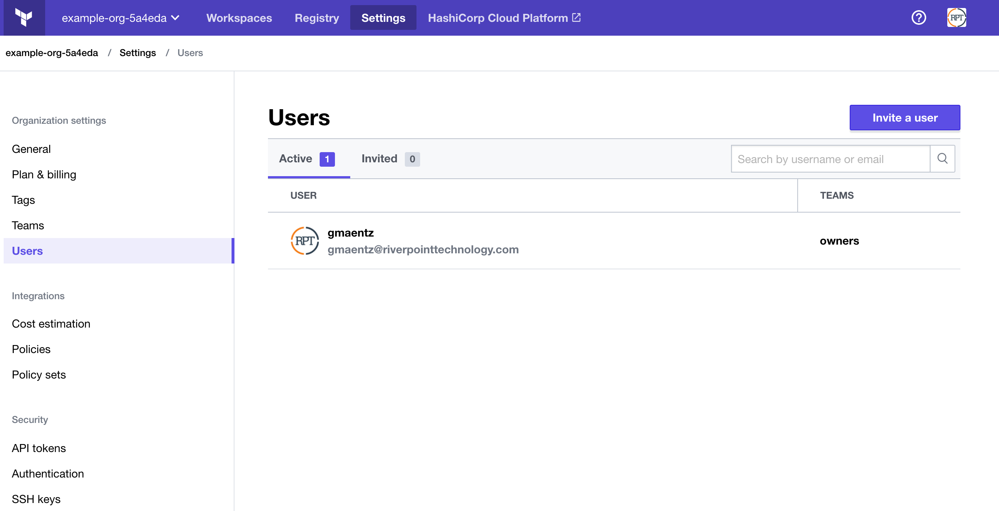
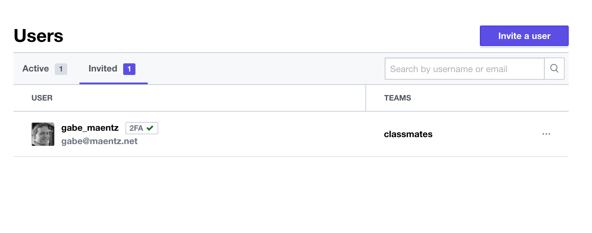
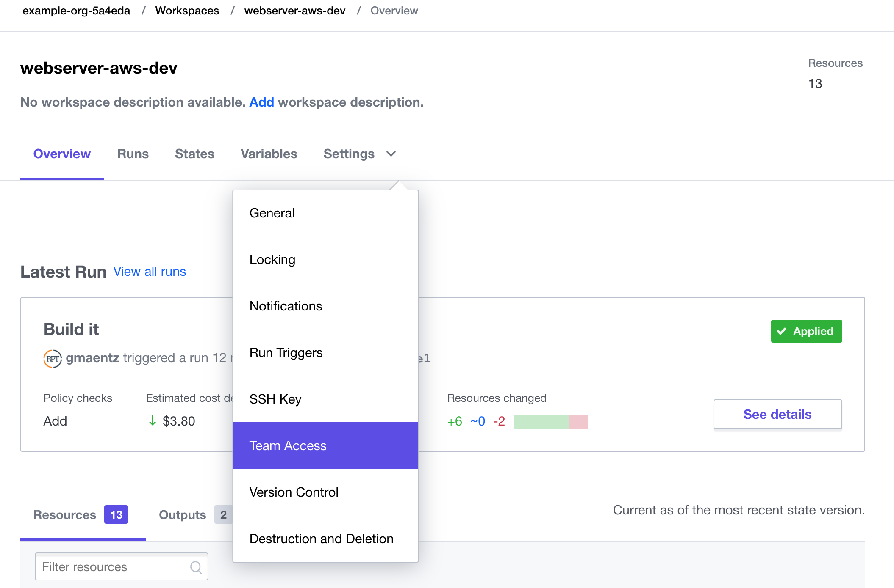
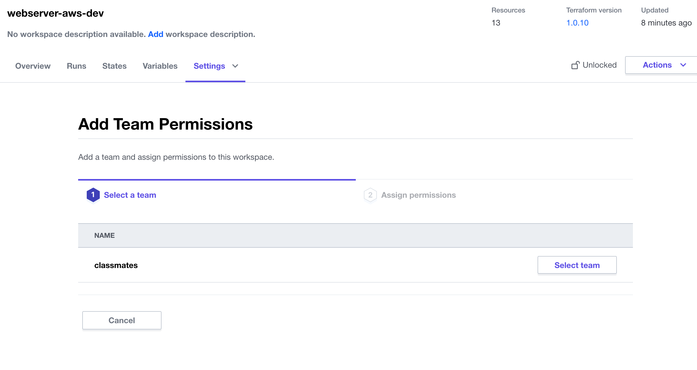
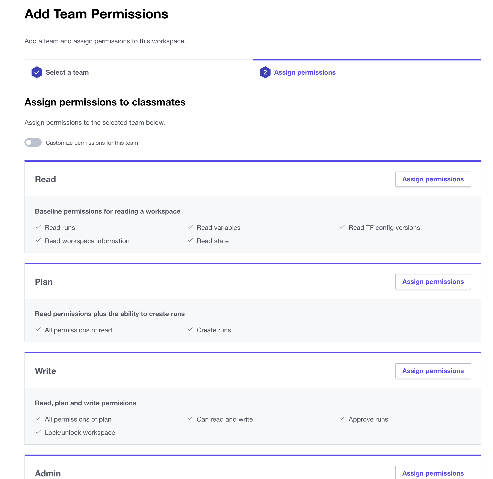

# Lab : TFC Teams

Duration: 20 minutes

This lab demonstrates collaboration for users and teams within an organization to share and update infrastructure deployments.

- Task 1: Create a new TFC Team
- Task 2: Invite a user to join the team
- Task 3: Permission your workspaces to provide access to the team
- Task 4: Validate classmates have read access to your TFC Organization.

## Task 1: Create a new TFC Team

TFC Organizations are shared spaces for teams to collaborate on workspaces, policies, and Terraform modules. Organizations can have many teams. Teams are groups of users that reflect your company's organization or project structure. Teams are created under the organization settings.

Create a Team within your organization called `classmates`

## Task 2: Invite a user to join the team

Invite fellow classmates to your organization by sending them a TFC invite to their registered email address.

Once they accept your invite, you can add them to your `classmates` team.

## Task 3: Permission your workspaces to provide access to the team

Teams themselves do not store permissions or other attributes - they exist only to group users into logical units, which can then be granted access to various resources within Terraform Cloud. Teams can be granted read, plan, write, and admin permissions to workspaces. Permissions are configured under workspace access settings.

Provide your `classmates` team read access to your `web-server-dev` workspace.

## Task 4: Ask a fellow classmate to confirm access to your TFC Organization

Now that you have users inside your team ask for you fellow classmates who you have invited to validate they have access to your `web-server-dev` workspace.