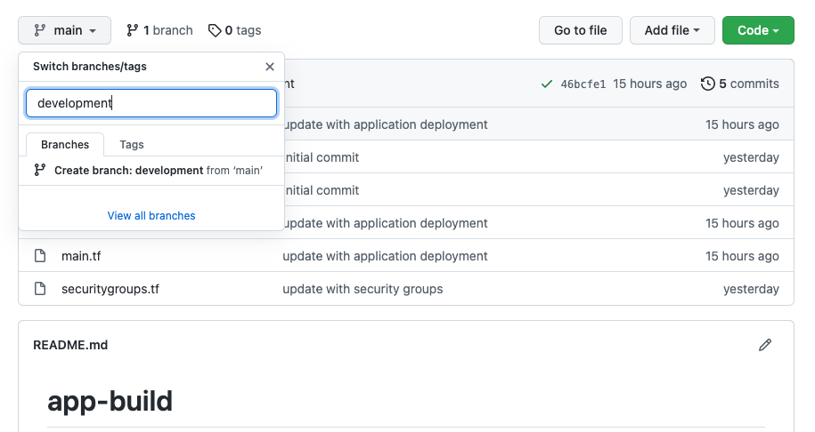
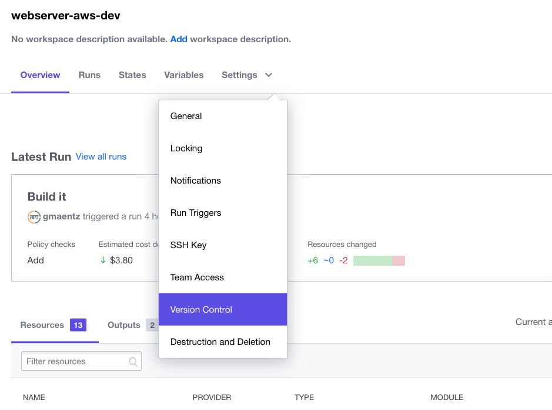
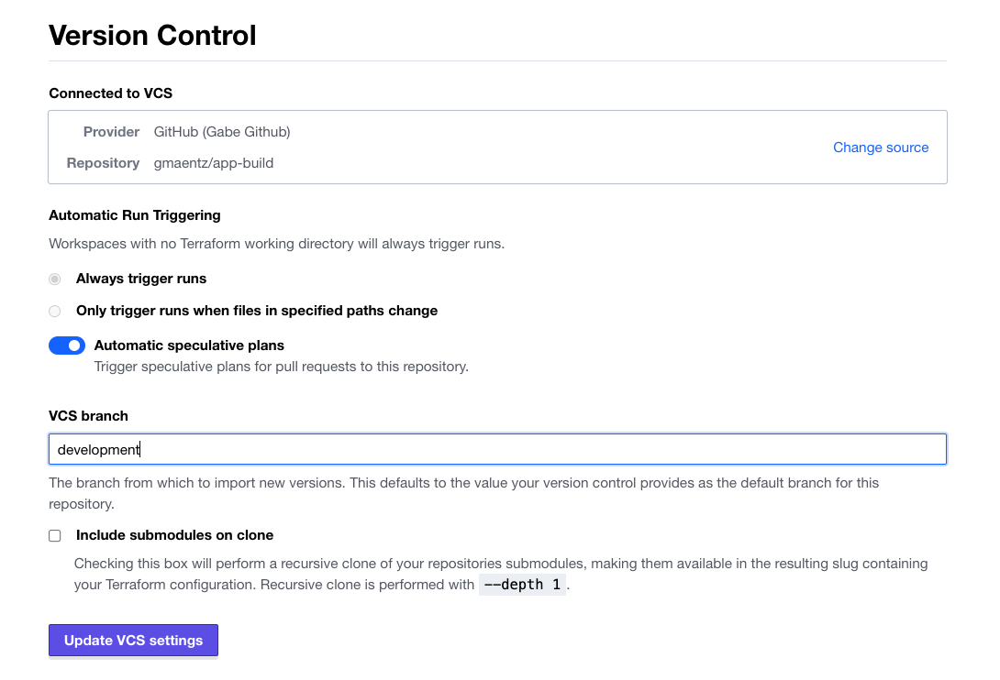
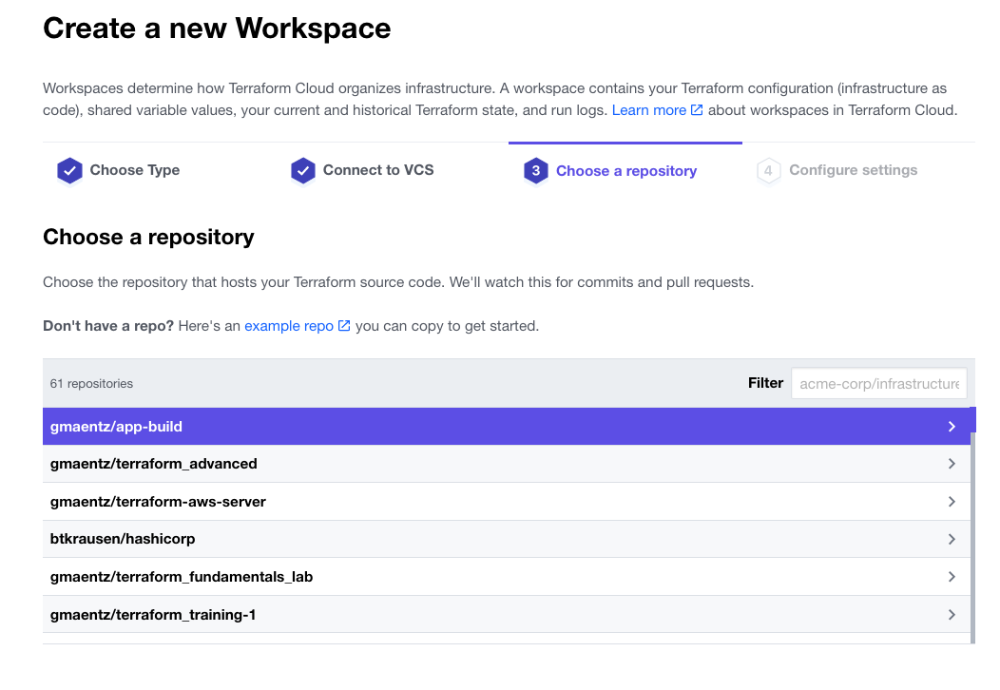
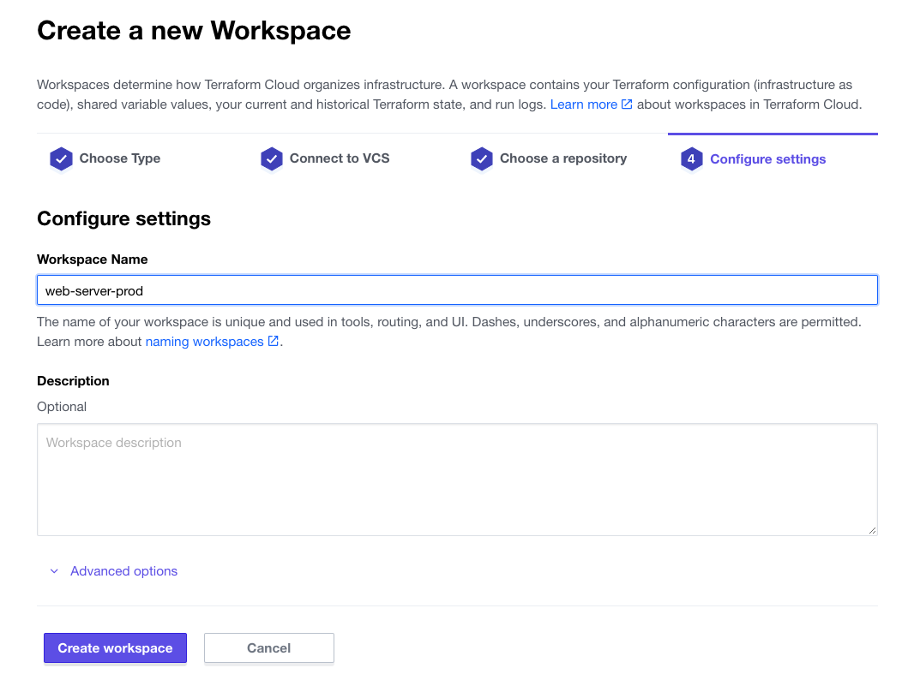
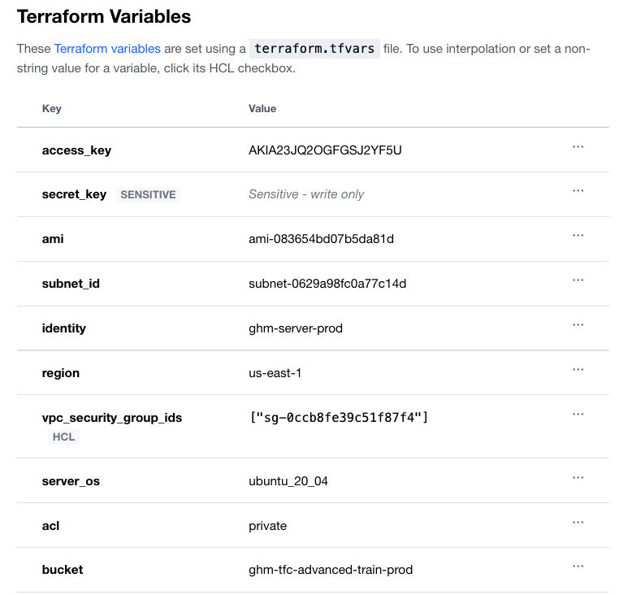
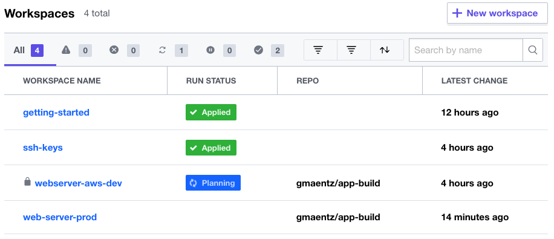
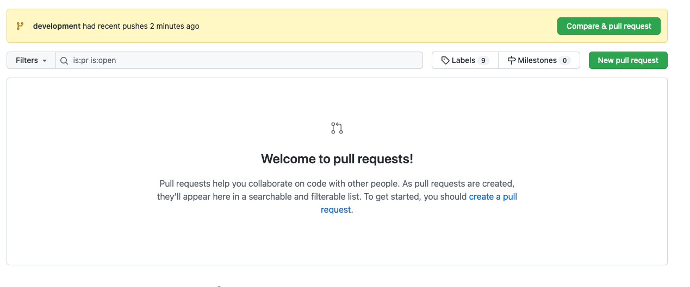
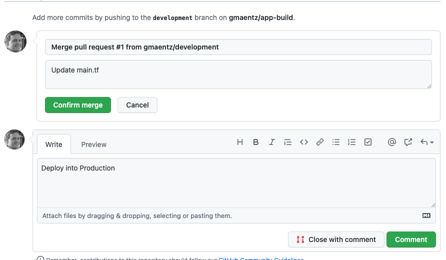

# Lab: Terraform Cloud - VCS Code Promotion

GitOps is an operational framework that takes DevOps best practices that we use for application development (Version Control / Collaboration / Compliance / CI/CD) and apply these core concepts to infrastructure automation

- IaC (Infrastructure as Code)
- Merge Requests
- Pipelines

In this challenge, we will utilize the benefits the VCS connected workflow to promote code from a `development` branch into our `main` branch of the `app-build` code repository.

- Task 1: Create a `development` branch in your `app-build` code repository.
- Task 2: Update your `web-server-dev` workspace to point to your `development` branch.
- Task 3: Perform and update on your development branch to validate
- Task 4: Create `web-server-prod` workspace to point to your `main` branch.
- Task 5: Update `development` branch
- Task 6: Merge Change into `main` branch

## Task 1: Create a development branch in your `app-build` code repository.

In the `app-build` github repository, create a `development` branch from the



## Task 2: Update your `web-server-dev` workspace to point to your `development` branch.

We will now update the Version Control setting of our `web-server-dev` workspace to point to our new `development` branch.



Update `VCS Branch` to `development`



- Task 3: Perform and update on your development branch to validate

This will trigger a Terraform run that is tied to the last commit on your `development` branch


## Task 4: Create `web-server-prod` workspace to point to your `main` branch.

Create a new TFC workspace named `web-server-prod` that is tied to the `app-build` github repo by choosing a VCS Control workflow.





Update the variables of the new workspace with the values that were specified in the `web-server-dev` workspace, but add a `-prod` suffix on the `identity` and `bucket` variables.



Update the `ssh-keys` workspace to allow for the `web-server-prod` workspace to utilize the shared keys.


Once updated perform an planned run within the `web-server-prod` workspace to validate the buildout of the production environment.


## Task 5: Update `development` branch

Update the `main.tf` in the development branch to include an server for `ngnix`.

`main.tf`

```hcl
locals {
  servers = {
    server-iis = {
      server_os              = "windows_2019"
      identity               = "$var.identity-windows"
      subnet_id              = var.subnet_id
      vpc_security_group_ids = var.vpc_security_group_ids
    },
    server-apache = {
      server_os              = "ubuntu_20_04"
      identity               = "$var.identity-ubuntu"
      subnet_id              = var.subnet_id
      vpc_security_group_ids = var.vpc_security_group_ids
    },
    server-nginx = {
      server_os              = "ubuntu_20_04"
      identity               = "$var.identity-ubuntu"
      subnet_id              = var.subnet_id
      vpc_security_group_ids = var.vpc_security_group_ids
    }
  }
}
```

Commit the change to the `development` branch, and view the impact on your `web-server-dev` TFC workspace.



Confirm and Apply the update on the `web-server-dev` workspace.

## Task 6: Merge Change into `main` branch

Once the `web-server-dev` TFC workspace completes its run, perform a pull request to



The GitOps workflow allows code to be merged into another branch via a merge request. Terraform Cloud's VCS control workflow integrates into this process showing if the deployment into the `web-server-dev` workspace was succesful.


This allows the merge request approver to have visibility that the code change was succesful in the `development` environment, and view the details of the change within Terraform Cloud.

When the Merge is approved this will automatically trigger the deployment of the code into the `web-server-prod` workspace.



We have sucessfully now made changes into the development environment and promoted those changes into production via a GitOps workflow.

